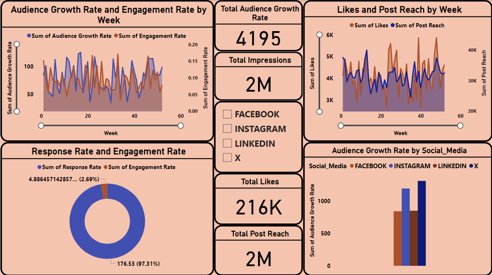

# Social Media Performance Analysis

## Overview
This project is an analysis of social media performance across Facebook, Instagram, LinkedIn, and X. I built this dashboard to track how audience growth and engagement rates change over time and to see which platforms are actually performing best.

## What I did in this project
* [cite_start]**Data Processing:** I handled a dataset with over 2 million impressions and 216k likes. I used DAX to calculate growth rates and engagement percentages to make the data more meaningful.
* **Trend Analysis:** I focused on a 52-week trend to find the relationship between how fast an audience grows vs. how much they actually interact with the content.
* **Platform Comparison:** I built comparisons to show that while some platforms have more reach, others might have better engagement rates, helping to decide where to focus marketing efforts.

## Tools used
* [cite_start]**Power BI / Tableau** for the visualization.
* [cite_start]**DAX** for custom measures and data transformation[cite: 39].

## Final Dashboard

## Author
Mohab Emad
